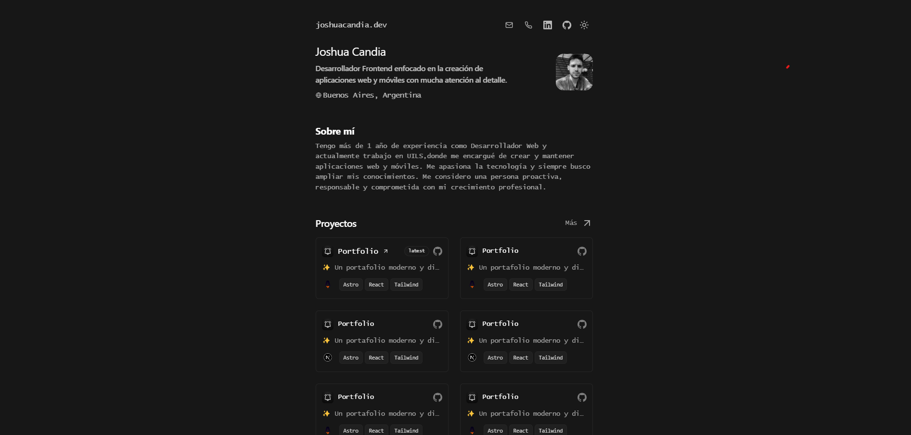

 
<h2>
    <em>Portfolio</em> minimalista maquetado para web y pdf
</h2>

Basado en el diseño de <a href="https://github.com/midudev/minimalist-portfolio-json">Midudev</a>

</img>

## 🛠️ Stack

- [**Astro**](https://astro.build/) - El framework web de la nueva época.
- [**Typescript**](https://www.typescriptlang.org/) - JavaScript con sintaxis de tipado.
- [**Ninja Keys**](https://github.com/ssleptsov/ninja-keys) - Menu desplegable con atajos de teclado hecho en puro Javascript.
